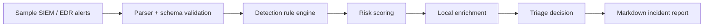

# AI SOC Copilot

A defensive SOC engineering portfolio project that turns noisy security alerts into structured triage decisions, analyst-ready investigation notes, and safe incident summaries.

This is not an offensive tool. It is a local-first SOC assistant designed for alert enrichment, prioritization, and reporting using transparent detection logic instead of black-box claims.

## SOC use case

Security teams receive repeated alerts from EDR, SIEM, firewall, identity, and endpoint logs. Junior analysts often need to answer the same first questions:

- What happened?
- Which host or user is affected?
- How severe is the alert?
- Which MITRE ATT&CK tactic is likely involved?
- What evidence should be checked next?
- What can be written in the incident ticket?

AI SOC Copilot automates the first-pass triage workflow while keeping the final decision with the analyst.

## Features

- JSONL alert ingestion with strict input validation.
- Rule-based detection and risk scoring.
- MITRE-style tactic mapping for common SOC scenarios.
- Safe enrichment from local indicators only.
- Analyst notes generated from evidence, not invented facts.
- Markdown incident report export.
- Sample logs and validation tests.
- Secure defaults: no secrets, no external calls, no dangerous execution.

## Architecture



## Repository structure

```text
ai-soc-copilot/
├── src/ai_soc_copilot/
│   ├── cli.py
│   ├── detection.py
│   ├── enrichment.py
│   ├── models.py
│   ├── parser.py
│   ├── report.py
│   └── triage.py
├── rules/detections.json
├── samples/security_events.jsonl
├── tests/test_triage.py
├── docs/architecture.md
├── .env.example
├── .gitignore
├── SECURITY.md
└── pyproject.toml
```

## Quick start

```bash
python -m venv .venv
source .venv/bin/activate  # Windows: .venv\\Scripts\\activate
pip install -e .
python -m ai_soc_copilot.cli --input samples/security_events.jsonl --output reports/incident_report.md
```

## Example output

```text
Processed alerts: 5
High severity: 2
Medium severity: 2
Low severity: 1
Report written to reports/incident_report.md
```

## Detection examples

| Rule | What it detects | SOC value |
|---|---|---|
| AUTH-001 | Multiple failed logins followed by success | Possible account compromise |
| PROC-002 | Suspicious PowerShell arguments | Endpoint investigation priority |
| NET-003 | Rare outbound destination from workstation | Possible command-and-control lead |
| IAM-004 | New privileged group membership | Identity security escalation |

## Security and responsible use

This project is intentionally defensive. It does not exploit systems, steal credentials, deploy malware, or run arbitrary commands. All included data is synthetic and safe for portfolio demonstration.

See [SECURITY.md](SECURITY.md) for secure-use notes.

## CV-ready description

**AI SOC Copilot** — Built a local-first defensive SOC triage assistant that ingests SIEM/EDR-style JSONL alerts, validates event schemas, applies transparent detection rules, maps findings to MITRE-style tactics, scores risk, enriches indicators locally, and generates analyst-ready Markdown incident reports with safe sample data and validation tests.

## Tech stack

Python 3.11+, dataclasses, argparse, JSONL, pytest, Markdown, Mermaid diagrams.
