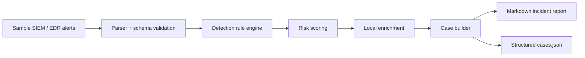

# AI SOC Copilot

A defensive SOC engineering portfolio project that turns noisy security alerts into structured triage decisions, analyst-ready cases, local enrichment notes, and safe incident reports.

This is a local-first SOC assistant for alert prioritization and reporting using transparent logic instead of black-box claims.

## Portfolio value

AI SOC Copilot demonstrates practical SOC engineering: reliable parsing, rule-based detection, evidence preservation, analyst workflow design, safe reporting, and security-focused code structure.

## SOC use case

SOC teams receive repeated alerts from EDR, SIEM, firewall, identity, and endpoint logs. Analysts need to understand what happened, which host or user is affected, how severe the event is, which findings belong together, and what evidence should be reviewed next.

## Features

- JSONL alert ingestion with strict input validation.
- Rule-based detection and risk scoring.
- SOC context mapping for common monitoring scenarios.
- Safe enrichment from local indicators only.
- Deterministic case grouping by host and user.
- Analyst case queue with priority, observables, timeline, and recommended actions.
- Markdown incident report export.
- Structured `cases.json` export for dashboards or future APIs.
- Sample logs and validation tests.
- Secure defaults: no secrets, no external calls, no unsafe execution.

## Architecture



## Repository structure

```text
ai-soc-copilot/
├── src/ai_soc_copilot/
│   ├── case_builder.py
│   ├── cli.py
│   ├── detection.py
│   ├── enrichment.py
│   ├── models.py
│   ├── parser.py
│   ├── report.py
│   └── triage.py
├── rules/detections.json
├── samples/security_events.jsonl
├── tests/test_case_builder.py
├── tests/test_triage.py
├── docs/architecture.md
├── docs/case-management-workflow.md
├── .env.example
├── .gitignore
├── SECURITY.md
└── pyproject.toml
```

## Quick start

```bash
python -m venv .venv
source .venv/bin/activate  # Windows: .venv\\Scripts\\activate
pip install -e .
python -m ai_soc_copilot.cli --input samples/security_events.jsonl --output reports/incident_report.md --case-json reports/cases.json
```

## Example output

```text
Processed events: 5
Findings: 5
Cases: 4
Markdown report written to reports/incident_report.md
Structured cases written to reports/cases.json
```

## Case management workflow

The case builder groups matching findings by host and user, then produces a deterministic `CASE-*` ID, priority, timeline, observables, context labels, and response guidance. See [`docs/case-management-workflow.md`](docs/case-management-workflow.md).

## Security and responsible use

This project is intentionally defensive. It does not exploit systems, collect private data, deploy unsafe code, or run arbitrary commands. All included data is synthetic and safe for portfolio demonstration.

See [SECURITY.md](SECURITY.md) for secure-use notes.

## Dependency and security notes

- Keep the project local unless intentionally integrating it into a lab dashboard.
- Use `.env.example` for configuration documentation and never commit `.env` files.
- Run tests before publishing changes.
- Treat sample reports as demonstration artifacts, not real incident records.

## CV-ready description

**AI SOC Copilot** — Built a local-first defensive SOC triage assistant that ingests SIEM/EDR-style JSONL alerts, validates event schemas, applies transparent detection rules, scores risk, correlates findings into analyst cases, extracts safe observables, and generates Markdown plus JSON case reports with synthetic sample data and validation tests.

## Tech stack

Python 3.11+, dataclasses, argparse, JSONL, pytest, Markdown, and Mermaid diagrams.
