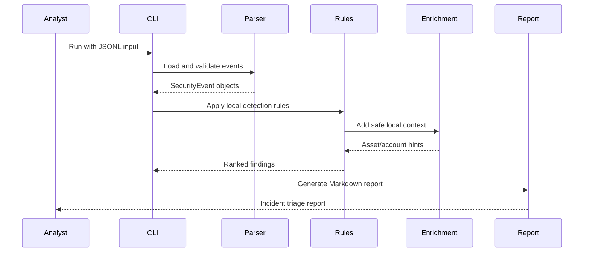

# Architecture

AI SOC Copilot is intentionally simple, inspectable, and safe for a defensive security portfolio. The goal is to show SOC engineering thinking, not to hide logic behind a black box.

## Data flow

## Components

### Parser

`parser.py` reads JSONL events and validates required fields. It rejects malformed lines, unsupported event types, oversized strings, and non-object attributes.

### Detection engine

`detection.py` loads local JSON rules. Rules match event type plus keyword evidence. The design is intentionally transparent so a SOC analyst can explain why an alert was raised.

### Enrichment

`enrichment.py` adds local context such as high-value host hints and service account classification. It does not contact external threat intelligence services by default, which keeps the demo safe and reproducible.

### Triage

`triage.py` converts scores into severity buckets and builds investigation summaries.

### Report

`report.py` generates Markdown that can be copied into a ticketing system, internship report, or portfolio screenshot.

## Threat model

| Risk | Control |
|---|---|
| Real logs accidentally committed | `.gitignore`, synthetic samples only, SECURITY.md guidance |
| Secret leakage | `.env.example` only, no real `.env` |
| Unsafe execution | No shell calls, no eval, no dynamic code execution |
| Black-box false claims | Transparent rules and deterministic scoring |
| Oversized input | `--max-events` bound and parser validation |

## Design notes

The visual identity should stay minimal: clean SOC dashboard style, calm colors, and no exaggerated capability claims. The strongest portfolio angle is transparent, analyst-controlled automation.
