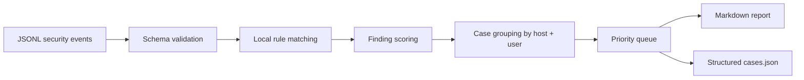

# SOC Case Management Workflow

AI SOC Copilot now separates raw findings from analyst cases. This makes the project closer to how real SOC teams work: alerts are useful, but analysts need a case queue with priority, timeline, observables, evidence, and response actions.

## Workflow

## Case fields

| Field | Purpose |
|---|---|
| `case_id` | Deterministic identifier generated from host, user, and matched rules. |
| `priority` | Analyst queue priority from P1 to P4. |
| `risk_score` | Highest finding score inside the case. |
| `title` | Human-readable case title. |
| `host` / `user` | Primary entity pair for investigation. |
| `tactics` | Rule-level SOC context. |
| `observables` | Safe local indicators from sample telemetry. |
| `timeline` | Evidence ordered by timestamp. |
| `recommended_actions` | Defensive analyst next steps. |

## Design notes

- Grouping is deterministic so repeated runs on the same data produce stable cases.
- The engine does not make external calls, enrich from unsafe sources, or invent details.
- Outputs are designed for portfolio screenshots, analyst reports, and future API/dashboard integration.
- Sample data uses documentation IP ranges and synthetic identities only.

## Security review checklist

- No secrets or real customer data are required.
- No shell commands are executed from event data.
- No `eval`, `exec`, unsafe deserialization, or remote execution is used.
- Input files are parsed as JSONL with schema validation.
- Output directories are created locally and contain only generated report artifacts.
